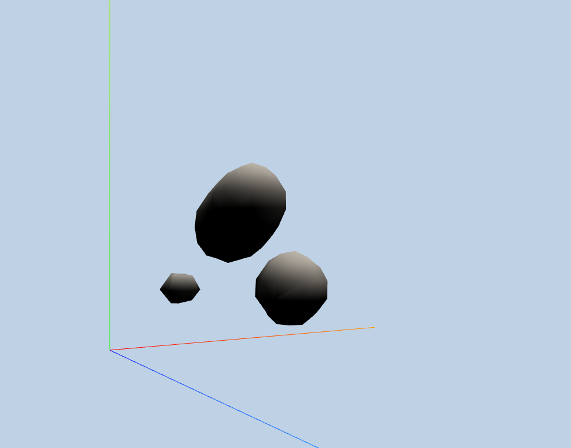

# Project 6: Marching Cubes

[Demo](http://josephgao.me/Project6-MarchingCubes-Implicit-Surfaces/)

* Author: Joseph Gao
* PennKey: gaoj

**Goal:** Create some cool shaders using WebGL.

* DISCLAIMER - The metaballs run very slowly. This could be due to my own local environment. The performance is bad enough that I am unable to work on the custom shader part. I will make my pull request now and continue to try and optimize. In addition, the some GUI buttons are still broken! (WIP).

## 90 points worth of materials implemented.

### Animation of Metaballs
This step was done by simply adding to each metaball position the current velocity components.

### Sampling at Corners
To accomplish this, I defined some new inspection points and then ran my sampling function at each of these corners. Each voxel box has eight possible corner points. 

### Polygonization 
My code and ideas are heavily based off of Paul Bourke's ideas. I used the tables provided to correctly find the triangles and edges that would be intersected, and wrote my own interpolation function based off of Paul's to figure out exactly where each edge will be cut. 

### Meshing
To do meshing, I first created the mesh with the appropriate shader material, and then I would call polygonize on each voxel and figure out what vertices need to be changed for the mesh to have its adaptive look and feel. 

### Materials and post-processing
This part I had some trouble with, and it is still a WIP. I will submit a pull request now as to not be too late, and if I have any cool updates I will push to my github pages profile.
