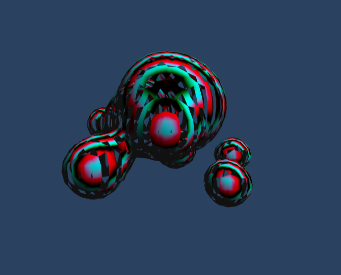

# Project 6: Implicit surfaces - Marching cubes

**Note:** The cool looking tearing effect is not a feature. It's a bug. I am trying since yesterday to figure out what's causing it. I am out of ideas.

**Shader:** Did not get enough time to include any post shaders, but I did include the iridescence shader. Looks cool!

**References:**

1. Marching cubes:
https://developer.nvidia.com/gpugems/GPUGems3/gpugems3_ch01.html

2. Edge-Table, Tri-Table, Marching cubes:
http://paulbourke.net/geometry/polygonise/

3. Lerping with reduced edge gaps:
http://paulbourke.net/geometry/polygonise/interp.c

4. Metaballs:
http://jamie-wong.com/2014/08/19/metaballs-and-marching-squares/
