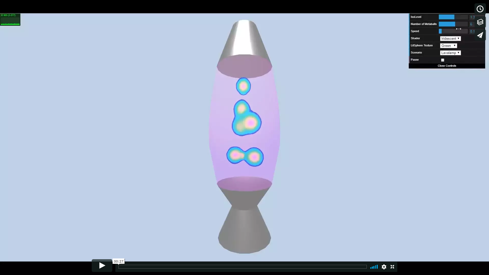
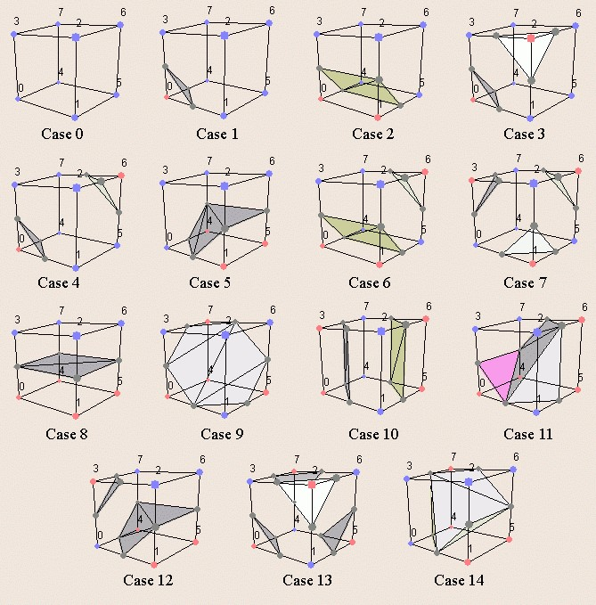
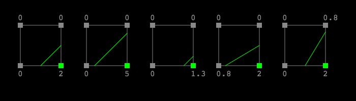
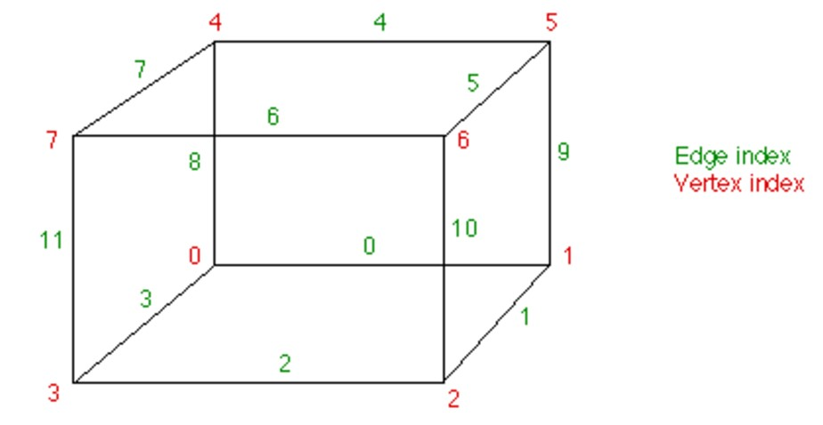
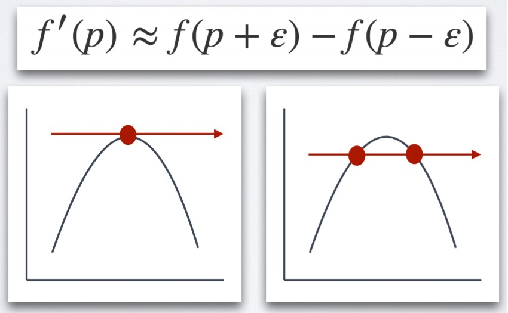
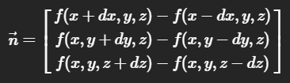
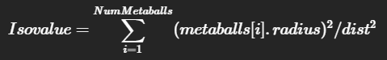

# Metaballic Lava Lamp

## Overview

Metaballs are organic looking n-dimensional objects that are really popular for creating smooth and dynamic shapes. Each metaball is defined as a function having n-dimensions (in this case 3 dimensions). A threshold, also known as the iso-level is chosen to define the iso-surface formed from the combined influence of all the metaballs which defines the resulting shape.

## Technical Approach

Since the resulting iso-surface is defined by a density or influence function, the naive approach would be to evaluate that function for every point in space, where the resolution of the space would define the smoothness of the surface. This as one might expect is ridiculously expensive computationally speaking, but there are better techniques we can leverage:

### Marching Cubes Algorithm

To ease the computation involved, we voxelize the space up to a desired resolution and then for every voxel query the density function and use the reulting values to draw a 3D polygonal approximation of the surface. There are 256 (2^8) configurations for a voxel sampled at its 8 corners, however only 15 different configurations can be used to represent all 256 due to symmetry and with the help of rotations; and all of these configurations can be represented with upto 5 triangles/voxel.

#### Linear Interpolation

_A 2D example showing how varying densities can effect the edge (isoline) that is formed._

The polygonal configurations above can be made a more accurate representation of the isosurface even at low resolutions by using the density values at the corners to find new points on the bounding box of the voxel to define the lines that make the triangles of the isosurface.

### Look Up Tables

The eight corners of the voxel can be represented by an 8-bit number, where 1 means the isovalue is above or below the isolevel based on some predefined threshold.And the twelve edges of the voxel can be represented as a 12-bit number, where 1 means that the isosurface intersects with this edge.

#### EDGE_TABLE: 

This table returns a 12-bit number that represents the edges intersected by the isosurface. For each intersected edge, we can compute the linearly interpolated vertex position on the edge according to the isovalue at each end corner of the edge.

#### TRI_TABLE: 

This table stores the triangle indices corresponding to the vertex positions on the edges identified above. Every 16 elements in the table represents a possible polygonizing configuration. Within each configuration, every three consecutive elements represents the indices of a triangle that should be created from the edges above.

### Normal Calculations

Having implemented all of the above, our metaballs would look quite low poly at lower resolutions. An easy fix for this is to calculate the normal for all the points that makes the polygonal configuration of the voxel. This gives us per-vertex data for normals which when passed through a fragment shader results in a much smoother surface than before (it is the equivalent of the switch from having normals per face to having normals per vertex of the mesh). 

Calculating the normal at an arbitrary point involves finding the gradient at that point. This can be expensive so a good approximation for the same is to sample neighboring points along the n-dimensions, and use their difference to approximate the slope.

A 1D representation would be:

For 3D density functions the normal would be represented as:

### Density Function
Defined as the sum of the influences of all the metaballs within its vicinity, which have a inverse square fall-off in terms of intensity

## More about the Marching Cubes Algorithm
The Marching cubes algorithm can achieve a effect similar to ray marching for rendering implicit surfaces, but in addition to the rendered image, you also retain geometry.

Common Use Cases:
- In MRI scanning, to generate geometry for the scans.
- To generate complex terrain for games. The resulting geometrical information can handily support collision and other physical calculation for game engines. For example, their bounding boxes can then be computed to construct the acceleration data structure for collisions.

## Resources
- [Generating complex terrain](https://developer.nvidia.com/gpugems/GPUGems3/gpugems3_ch01.html) from [GPU Gems 3](https://developer.nvidia.com/gpugems/GPUGems3/gpugems3_pref01.html).
- [Polygonising a scalar field](http://paulbourke.net/geometry/polygonise/) by Paul Bourke.
- [Marching squares](http://jamie-wong.com/2014/08/19/metaballs-and-marching-squares/) by Jamie Wong.
