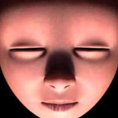

# Project 6: Implicit surfaces - Marching cubes

**Goal:** Implement an isosurface created from metaballs using the marching cubes algorithm. 

Metaballs are organic-looking n-dimensional objects. This is an implementation of 3-dimensional metaballs. They are great to make bloppy shapes. An isosurface is created whenever the metaball function crosses a certain threshold, called isolevel. The metaball function describes the total influences of each metaball to a given points. A metaball influence is a function between its radius and distance to the point:

`f(point) = (radius * radius) / (distance * distance)`

By summing up all these influences, it effectively describes all the points that are greater than the isolevel as inside, and less than the isolevel as outside (or vice versa). As an observation, the bigger the metaball's radius is, the bigger its influence is.

Marching cubes essentially voxelize the space, then generate triangles based on the density function distribution at the corners of each voxel. By increasing the voxelized grid's resolution, the surface eventually gets that blobby, organic look of the metaballs. Marching cubes can achieve a similar effect to ray marching for rendering implicit surfaces, but in addition to the rendered image, you also retain actual geometries. 

Marching cubes are commonly used in MRI scanning, where geometries are genereated for scans. Marching cubes are also used to generate complex terrains with caves in games. The additional geometry information can handily support collision and other physical calculation for game engines. For example, their bounding boxes can then be computed to construct the acceleration data structure for collisions.

## Resources
- [Generating complex terrain](https://developer.nvidia.com/gpugems/GPUGems3/gpugems3_ch01.html) from [GPU Gems 3](https://developer.nvidia.com/gpugems/GPUGems3/gpugems3_pref01.html).
- [Polygonising a scalar field](http://paulbourke.net/geometry/polygonise/) by Paul Bourke.
- [Marching squares](http://jamie-wong.com/2014/08/19/metaballs-and-marching-squares/) by Jamie Wong.

## Design Process
I wanted to take advantage of the metaballs' blobby movement, so I started off with the idea of a metaball Newton's cradle. After figuring out the physics of the Newton's cradle and modeling it in code, I realized that the resting middle balls of Newton's cradle will be one long blob due to the influences. The visual appeal of one long blob was not strong to me, so I moved toward a different design. 

The next idea I had was a metaball lava lamp. Even though the metaball lava lamp is a more straightforward design compared to Newton's cradle, it seemed more dynamic and interesting because the metaballs moved in all three dimensions. Of course, I did not want to have a mundane lava lamp as my project, so I decided to spice it up a bit with shaders.

## Animating metaballs
My original implementation of animating metaballs is reversing the velocity when the metaball goes out of bounds. However, since the metaballs are mimicking the movement of blobs in a lava lamp, the metaballs should be rising to the top, and then sinking once it touches the roof of the lamp. The sinking and rising can easily be simulated by changing the sign of the metaball's velocity's y-component. If it intersects with the cylinder side before it reaches the top, the velocity should be reflected about the normal at the intersection point of the cylinder (similar to a ray reflected on a perfectly specular material), where the normal is the cylinder center minus the intersection point. A new velocity is assigned to the metaball every time it touches the floor and roof of the lava lamp, mimicking the heat transfer that fuels the movement of blobs in a real lava lamp.

## Materials and post-processing
I did not implement a lit-sphere shader before, but believed that this type of material would be strongest visually. This is because a lit-sphere shader is very flexible when it comes to the type of texture to apply on the metaballs. I was able to extract some lit-sphere textures from the Mudbox software, and have grown to like this one specifically:

However, I wanted the texture subject to be something more interesting. I thought, why not a face?

The problem with this face texture is that it does not have as strong of a three-dimensional shade as the lit-sphere texture I found from the Mudbox software. I ended up overlapping these two textures in Photoshop and compling something in between:

## Colors

